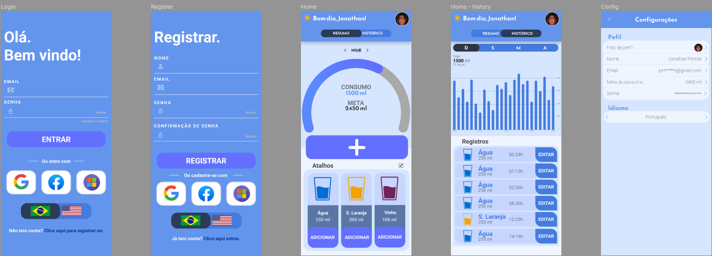

# Hydrate

<!---Esses são exemplos. Veja https://shields.io para outras pessoas ou para personalizar este conjunto de escudos. Você pode querer incluir dependências, status do projeto e informações de licença aqui--->

> Hydrate is an app to remind you to drink water and keep track of how much you've taken. What is great for your health.

### Steps to Completion

The project is still in development and the next updates will focus on the following tasks:

- [x] App design
- [ ] NestJs API
- [ ] Ionic APP
- [ ] Landing Page using React
